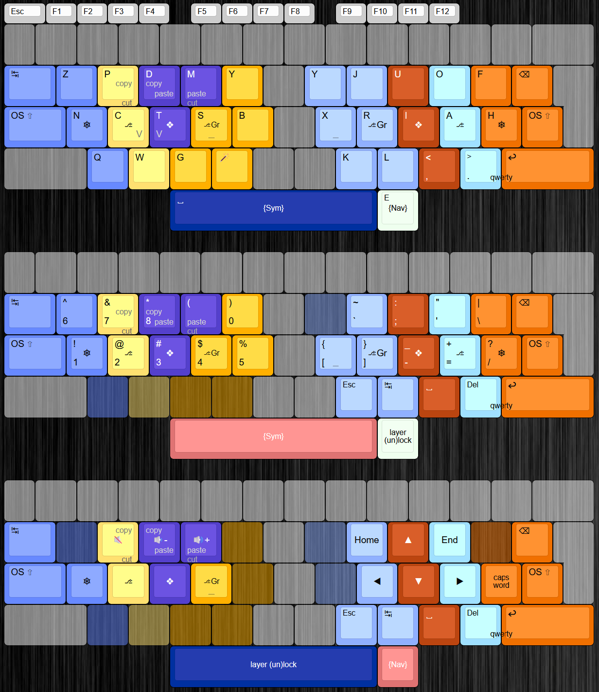

# KarlAKL

Karl is an angle-modded Kanata alternate keyboard layout for ISO rowstag keyboards created by Turtlyn, similar to her other layout Neon: https://codeberg.org/StrawberryTurtle/neon 

It belongs to the new "hair" family of layouts, where the right homerow consists of the keys `riah`. It also includes mirrored Y, one shot shift keys, and a repeat key. 

Turtlyn provided me with a nokwts-fingermap version, which is my preferred fingermap.

My own additions are the two layers Sym and Nav. Sym includes all numbers and symbols (except for , and . which are on the top layer).
The ' key is placed in the same spot as the O key but on the Sym layer. This combined with the sym layer being on the left thumb makes typing ' comfortable.

The letter V, as well as shortcuts for cut, copy and paste are provided through combos. I looked for the most comfortable position for the V combo since I don't like the qwerty B position where V is in the original layout.
A toggle for the qwerty layer is also available through the bottom right pinky + ring combo.

