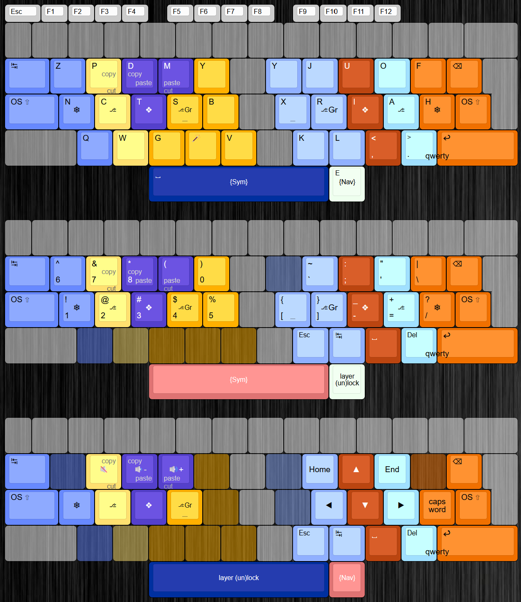

# KarlAKL

Karl is an angle-modded Kanata alternate keyboard layout for ISO roswtag keyboards created by Turtlyn, very similar to her other layout Neon: https://codeberg.org/StrawberryTurtle/neon 

It includes mirrored Y and one shot shift keys, and a repeat key. 

My own additions are the two layers Sym and Nav. Sym includes all numbers and symbols (except for , and . which are on the top layer) as well as shortcuts for cut, copy and paste.
The ' key is placed in the same spot as the O key but on the Sym layer. This combined with the sym layer being on the left thumb makes typing ' comfortable.

